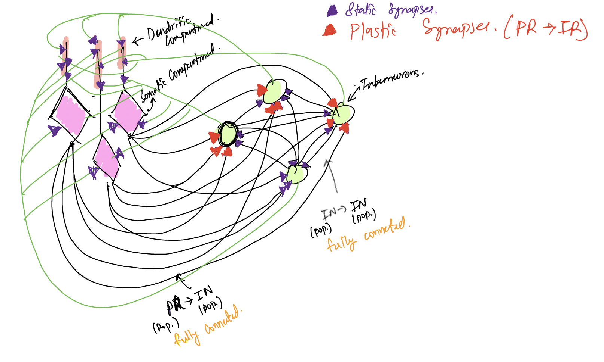

# Review: Optimizing interneurons circuit for compartment specific feedback inhibition

`yetztML`

### Authors_: J. Keijser, H. Sprekelar_

## Broad Stroke

Suppose that you like to figure out the configuration of a 2\-Population network of neurons, such that one population is receiving external input in different compartments and the other population is in charge of inhibiting the first in order to prevent it from getting saturated. This paper provides a method to use "surrogate"gradient descent to obtain an optimal connection configuration of such a networks.

Question/Thought:

After optimization, we will have a network that is good for a particular type of input pairs \(determined by their correlation\). One may want an adaptive network that can adapt itself based on the input correlation. Would Naumann et al. \(2022\) be a possible way to go here ?

## Abstract/Summary

Inhibitory interneurons serve as mechanism to provide network stability by means of feedback inhibition. Although this has been ascertained with confidence, the granularity or the specificity of the inhibition is not well understood. In this paper, the authors attempt to optimize a network such that the interneurons learn to provide compartment\-specific inhibition to the different compartment of a population of Pyramidal neurons. The following subsections will clarify this point further.

Why Compartment\-Specific Feedback?

Different compartments of a pyramidal neurons receive input from different sources. These inputs into the compartments \(we consider two compartment: somatic and dendritic\) are non\-linearly integrated into the neuronal output spikes which then serve as inputs to interneurons. The receiving interneurons are responsible for providing inhibitory feedback to the compartments such that the neurons main E/I \(Excitation/Inhibitory\) balance, which is essential for non\-saturating networks. Since the input to the compartments \(Es\) are different, the feedback inhibition \(Is\) needs to be different as well. Hence, the feedback from the interneurons must be compartment\-specific. In other words, the interneurons must be able to reverse the non\-linear integration of inputs that happens in the pyramidal neuron.

### Network Setup

In order to explore the hypothesis, a network is setup such that it has a population of pyramidal neurons \(PRs\) and another population of interneurons\(INs\), as depicted by the diagram below.

The PRs are modelled using a two\-compartment model, namely a somatic compartment and a dendritic compartment \(Details in Appendix A.1\). These compartments receive \<uncorrelated\> time\-varying  external excitatory input and inhibitory input rom the interneuron population in a fully\-connected manner, i.e. each interneuron projects onto each pyramidal compartment. These IN =\> PR synapses are static and non\-plastic. The interneurons receive excitatory input from the somatic compartment \(pyramidal spikes\) and inhibitory input from other inhibitory neurons. The PR =\> IN connections are plastic and undergo short\-term plasticity \(Details in Appendix A.2\). 

At the start of the simulation, all the interneurons are homogenous and provide homogenous feedback to the two compartments.

Optimization

The above network is optimized in order to investigate whether compartment\-specific inhibition can arise within the network. In order to do so, all the synaptic weights in the network were optimised by means of a surrogate gradient \(Appendix A.3\) that minimized the mean squared error between the excitatory and inhibitory inputs in both compartments. Besides the synaptic connections, the short\-term plasticity of the PR =\> IN connections are optimized as well. In order

## Key findings

After the training of the network the following phenomenon emerged:

Interneuron Diversity

The initially homogenous group of interneurons cluster into two separate groups, one group is similar to PV interneurons and the other group exhibits similarity with SST interneurons.

_PV_ _Interneurons_: These neurons receive short\-term depressing inputs from the PRs \(Observed through mean PPR\). Moreover, they preferentially target the somatic compartment for inhibition, meaning that post\-optimization their synaptic connection to the dendrites is close to 0 but non\-0 for the somatic compartment. 

_SST Interneurons:_ These neurons receive short\-term facilitating inputs from the PRs \(Observed through mean PPR\). Moreover, they preferentially target the dendritic compartment for inhibition.

Feedback Inhibition Decodes Compartment Specific Inputs

As mentioned, compartment\-specific inhibition essentially comes down to inverting the non\-linear integration performed by the pyramidal neurons. If it is assumed that the output of PNs is the multiplexed neural code suggested in \(R.1\), then the interneuron network can be tested on whether the correct decoding is done by changing the inputs to the overall network.

_Multiplexed Neural Code_:

In this code, it is suggested that temporal spike patterns of the output of the PNs simultaneously encode the input to the somatic as well as the dendritic compartments. Somatic input increases the probability of an event, either a spike or a burst \(alters event rate\). Dendritic input increases the probability of a spike bring converted to a burst \(alters burst rate\). 

In order to test whether the network decodes such a neural code, pulses of current were injected into the somatic and dendritic compartments. Injecting current pulses into the somatic compartment resulted in the increase in the event rate, which increased the firing rate of the PVs and in turn increases the inhibition to the soma, while dendritic inhibition was largely unaffected.

 On the other hand, injecting current pulses into the dendrite resulted in a higher burst rate, which increased the firing of the SSTs and thus inhibition to the dendritic compartment, while somatic inhibition was largely unaffected.

_Short\-term Plasticity\(STP\)_:

In the absence of _STP_, SSTs were not selectively activated by bursts, and the E/I balance could not be maintained. Similarly, weak\-somatic input required selective activation of PVs, but without _STP_  this disappeared as well.

Therefore, STP is necessary for such selective activation.

Conditions of emergence of compartment\-specific inhibition

_Correlation of compartment inputs_

Much of the above summary is on uncorrelated somatic and dendritic inputs. In such cases, the PVs and SSTs separated into distinct groups. As the correlation between the inputs was increased, the separation of the interneurons changed from being less distinct to form more of a continuum. This makes sense, since correlated inputs to the compartment essentially reduces the need for the compartments to be inhibited with high specificity. 

_IN\-PN Inhibitory Connectivity_

Much of the above discussion is on homogenous IN\-PN connectivity. Allowing heterogenous connectivity reduces specificity.

_Connectivity among Interneurons_

Only PV =\> SST connections were required for compartment\-specific inhibition. The analysis is provided in the Paper.

## Appendix/Further Reading

A.1 Pyramidal Neuron Model

- W Gerstner, W Kistler, R Naud, L Paninski _Neuronal Dynamics_\(Cambridge Univ Press, Cambridge, UK, 2014\).

A.2 Plasticity Model for PN\-IN Synapses

- The neural code between neocortical pyramidal neurons depends on neurotransmitter release probability \([Misha V. Tsodyks](https://www.pnas.org/doi/10.1073/pnas.94.2.719#con1) and [Henry Markram](https://www.pnas.org/doi/10.1073/pnas.94.2.719#con2)\)

A.3 Surrogate Gradients

- Supervised Learning in Multilayer Spiking Neural Netwotks \(Ioana Sporea m Andre Gruning\)

A.4 Non\-Homogenous Behaviour

How come neurons differentiate if they all start in the same state? If Interneurons receive the same input from the PRs, what makes then ever diverge?

- In order to have the neurons behave homogeneously, they all receive heterogenous background noise that ensures that the neurons have enough noise such that the network can develop and obtain a steady state where the neurons can be heterogeneous in function

R.1  

- Sparse bursts optimize information transmission in a multiplexed neural code \- [Richard Naud](https://www.pnas.org/doi/10.1073/pnas.1720995115?__cf_chl_tk=h921fBF3uKFNGQO845jAmvJeC3mkUHYii0oXKf7TRGc-1692443110-0-gaNycGzNCzs#con1), [Henning Sprekeler](https://www.pnas.org/doi/10.1073/pnas.1720995115?__cf_chl_tk=h921fBF3uKFNGQO845jAmvJeC3mkUHYii0oXKf7TRGc-1692443110-0-gaNycGzNCzs#con2) 
