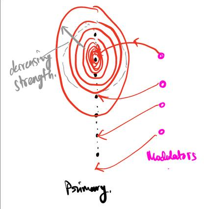
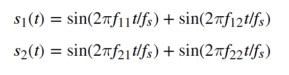
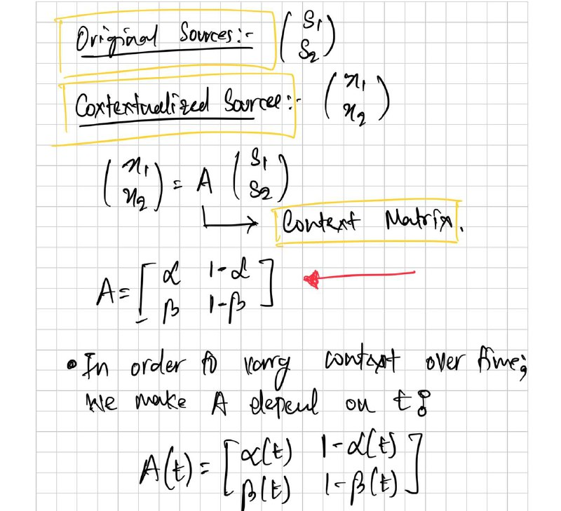
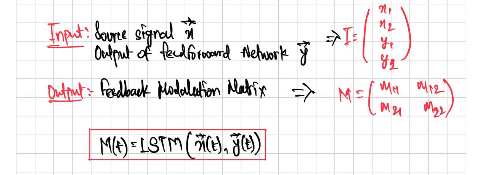

# Invariant neural subspaces maintained by feedback modulation

`yetztML`

Autors: Laura B Naumann, Joram Keijser, Henning Sprekeler

## Condensed Abstract 

- The paper investigates the role of a modulatory feedback in allowing sensory systems to reliably process incoming stimuli in spite of context changes
- The basic setup includes two stimuli sources which are linearly mixed two produce two contextualised stimuli, a modulator network \(to be trained\) which modulates a primary network, and the primary network which is meant to take the two contextualised stimuli as input and output the original unmixed sources
- The modulator network is trained using LSTMs

## Main Results

- Invariance can be established by slow feedback modulation
    - Changes to the basic network:
        - Instead of M being equal to the network output instantaneously, they are related by a first order differential equation
            - _tau dM = Wm\(\*\)LSTM\(input\) \- M , where \(\*\) is a convolution with the modulation kernel_
    - Results
        - Degradation of signal clarity observed 
    - \(Slow timescale \- Rapid change of variables, Fast timescale \- Relatively slower change of variables\)
- Invariance can be established by spatially diffusive feedback modulation
    - Changes to the basic network:
        - Consider the primary network has a 100 neurons and the Modulator network has 4
        - The modulation is organised in a manner such that the effect of each of the 4 modulation inputs is centered around one of the 100 neurons. Each of modulation input gets a different centre
        - From this centre, modulation decays as we move further away from the centre
        - 
    - Result/Conclusion
        - This model with less specific feedback \(compared to one\-to\-one in the basic network\) was able to complete the task
        - A few distinct feedback signals were required to obtain clean separation
        - Imprecise modulation is sufficient 
- Invariance emerges at a population level
    - Single neurons are strongly modulated by context
    - Context invariance only emerges on a population level
- Feedback reorients the population representation
- The mechanism generalises to hierarchical Delean networks
- Feedback conveys a non\-linear representation of the context

## Materials and Methods

- Source Signals
    - Each source is a composition of two sines
    - 
    - f\_s represents the sampling frequency
- Context Variation
    - In order to vary contexts, the two signals above are mixed linearly. The following sketch depicts this idea.
    - 
- Architecture of Modulator Network
    - 
        Inputs and Outputs
    - The LSTM network contains 100 hidden units
    - [LSTM Reference Blog](https://colah.github.io/posts/2015-08-Understanding-LSTMs/)
- Description of a single batch of training.
    1. We take two fixed signal sources, S1 and S2 \(When mixed, these become X1, X2\)
    2. We have a list of choices of A or the mixing matrices. 
        1. If we have a batch size of 32, then we basically train over 32 different As
        2. The target for for each "data point"/sequence is the transpose of A
        3. Applying M to A, if M equals Transpose of A un\-mixes the signal
        4. Linear Algebra: A is therefore chosen to be Orthogonal 
    3. For each A, we then pick a fixed snippet of the mixed signals
    4. The input to the modulator network is X1, X2 and M \* W \* \(X1, X2\)
        1. W being the unmodulated network weights \(=1\)
        2. M being the modulation matrix from the Modulation Network
    5. The signals are then passed into the modulator network one point at a time \(x1, x2, z1, z1\), \(x2, x2, z2, z2\), \(x3, x3, z3, z3\), ...., \(xn, xn, zn, zn\)
    6. The output is loss\-ed against A transpose
    7. Details of the LSTM:
        1. 100 hidden units
        2. The hidden output is passed into a feedforward network which outputs of desired shape
