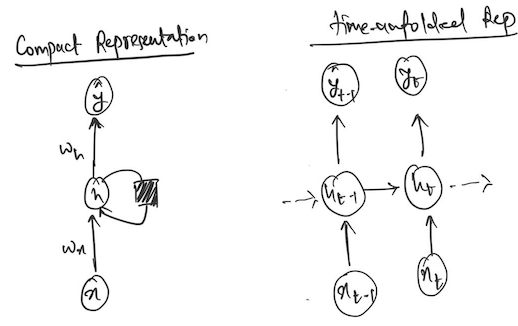
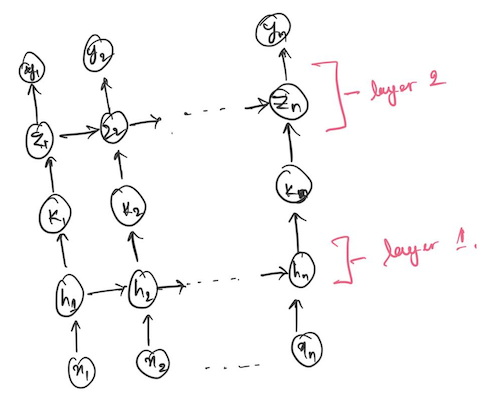

# The Mathematics of Long Short-Term Memory (LSTMs)

`yetztML`

## Recurrent Neural Networks

- Used primarily in sequence modelling such as sarcasm detection, language translation etc.

## Building Intuition

- What happens to a sequence during prediction \(Traditional RNN\):
    - The first item\(t=1\), is presented to the network \(x\(t=1\), h\(t=0\)\)
    - This may output y\(t=0\) and will produce h\(t=1\) which will be used in the next time step
    - This h\(t\) is what transmits temporal information
- Simple RNN in PyTorch
    - 
    - Can be visualised as below
    - 
    - Interesting parameters include:
        - The input size: Sets the expected dimensionality of each x\(t\) in a sequence
        - The hidden size: Sets the dimensionality of the hidden unit
        - Number of layers: Sets the number of recurrent layers
            - Would look as the following in the unfolded version with num \_layers=2
            - 
- Problems with RNNs
    - The primary issue with RNNs is that as the gradient is propagated backwards from the final time step \(last element in the sequence\), the gradients tends to explode or vanish
    - 
    - Mathematical proof is presented here \(Hochreiter et al. 1991\)
        - [https://www.researchgate.net/publication/13853244\_Long\_Short\-term\_Memory](https://www.researchgate.net/publication/13853244_Long_Short-term_Memory) \(Page 4\-5\)
        - 
        - Interpretation of the above equation or notes on retracing:
            - 
        - 
            The paper then goes onto demonstrate how the value above goes to 0 quite easily
        - To check how the bounds are derived in the above derivation: [https://datascience.stackexchange.com/questions/31449/hochreiter\-lstm\-p\-4\-maximal\-values\-of\-logistic\-sigmoid\-derivative\-times\-weig/104068\#104068](https://datascience.stackexchange.com/questions/31449/hochreiter-lstm-p-4-maximal-values-of-logistic-sigmoid-derivative-times-weig/104068#104068)
        - In order to interpret the derivative:
            - How does the change in a error at neuron x at time t, affect its error at time t\-q?
            - If the derivative always tends to 0, it shows that the model is not able to capture dependency between elements of the sequences we want to model that are farther than a few time steps

## LSTMs to the rescue

- Introduction of Gates and Recurrent State Connection
    - At any step, the input \(X\(t\)\) is the concatenation of the input in current step and the hidden of the previous time step
    - Input Gate: After the usual linear transformation \(IX\), and the activation, i\_g is a value between 0 and 1. It is used as a continuous switch for the input to enter the cell state 
    - Forget Gate: Works similar Input Gate, the gate value is used to potentially suppress previous cell state
    - Output Gate: Works similarly and is used to allow the passage of current cell state into the next hidden state
- 
    Skeleton of an LSTM cell without a forget gate \[FIGURE 8\]
- 
    \[Circles represent dimensionality\]
    [https://tung2389.github.io/coding\-note/unitslstm](https://tung2389.github.io/coding-note/unitslstm):
- The Original Idea:
    - Focus on FIGURE 8 where there is no Forget Gate
    - 
        Presented in original paper as \(ASSUMING SINGLE UNIT WITH A SINGLE CONNECTION TO ITSELF\):
        Since the below expression results in the vanishing gradient, the initial idea is to at least for recurrent connections to itself, the error flow should be 1
        - 
            This is done by setting f to be the identity function \(Which would normally in the naive form cause the hidden input the next time step explode over time ?\)
    - Considering an unit with only one input and one output 
        - The following visualisation shows how a particular weight can receive conflicting signals along the recurrent chain
            - 
        - This naturally extends to output connections as well
        - This conflicting signalling makes learning difficult which is what motivates the introduction of Gates into LSTM units
- Key mathematical tricks/techniques used to ensure Constant Error Carousal \(CEC\):
    - Errors are truncated once they leave memory cells and input gates
    - This ensures constant error flow though the internal states of the cells
    - The error arriving at the memory cell output is not back\-propagated to units v by external connections to inj; outj; cj.
    - Use the following to assist the understanding of the gradient equations
        - 
        - Sharing of input and output gates among the cells of a block lead to summations in the gradients
- Sources: 
    - [https://www.researchgate.net/publication/13853244\_Long\_Short\-term\_Memory](https://www.researchgate.net/publication/13853244_Long_Short-term_Memory)
    - [https://arxiv.org/abs/1909.09586](https://arxiv.org/abs/1909.09586)

## Demonstration Paper

- [https://elifesciences.org/articles/76096\#s4](https://elifesciences.org/articles/76096#s4)
