# Review: Stability and learning in excitatory synapses by nonlinear inhibitory synapses

`yetztML`

**A Paper By: Christoph MiehlIm Julijana Gjorgjieva**

## Short Summary

The paper introduces a new nonlinear inhibitory plasticity rule that allows excitatory synapses to a neuron to obtain a stable synaptic configuration not jarred by unlimited growth or silencing. They key network configuration used in the paper involves a population of presynaptic neurons that project onto a population of inhibitory neurons and a single postsynaptic neuron where the inhibitory neurons further project onto the postsynaptic neuron as shown in the diagram below:

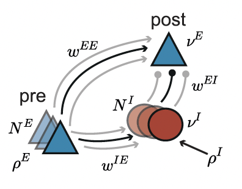

In the paper, the authors introduce a new plasticity rule for the inhibitory synapses such that that enable the excitatory synapses to reach a stable configuration. The paper starts with a linear plasticity model for the inhibitory synapses to demonstrate runaway dynamics under a wide variety of conditions and then present the new nonlinear model to establish contrast and the improved effectiveness of the non\-linear model as a means to prevent runaway dynamics.

## Computation Setup

The focus of the paper is to do the analysis using rate based neuronal and synaptic models. 

The firing rate of the postsynaptic neuron is given by the following:
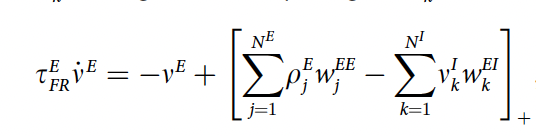

where the rate of change of the postsynaptic rate is promotional on the presynaptic firing rate, the E\-E weights and inversely proportional to the inhibitory firing rate.

The inhibitory neurons follow a similar dynamics:
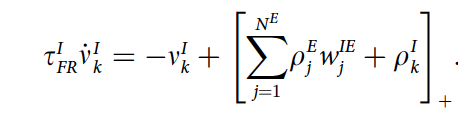

where the rate of change of a inhibitory neuron is directly proportional to the presynaptic firing rate, the I\-E \(E to I\)weights and the external inhibitory rate.

The excitatory synapses follow the following dynamics:
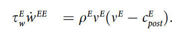

where the rate of change of the excitatory synaptic weight is directly proportional to the product of the presynaptic firing rate and the postsynaptic firing rate. Nonetheless, the sign of the change is determined by the whether the postsynaptic rate is higher or lower than a target rate \(/ excitatory postsynaptic threshold\). If higher, the sign is positive \(indicating potentiation\) and if lower, the synapses would undergo depression. According to this formulation, increasing the firing rate will cause potentiation of the excitatory synapses, and in a positive feedback loop cause the firing to further increase \- leading Hebbian runaway dynamics.

## Stability via inhibition Inhibition

Inhibition to counter runaway dynamics \(Linear\)

The main idea of this paper is to regulate the inhibitory input into the postsynaptic neuron in order to prevent runaway dynamics. Therefore the inhibitory synaptic dynamics were setup as follows:
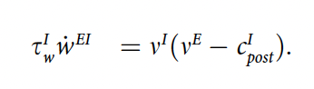

where the inhibitory weights are dependent on the product of the inhibitory rate and the the difference between the postsynaptic rate and the inhibitory postsynaptic thresholds. When the postsynaptic rate is higher than the threshold, the weights would increase \(lead to higher downstream inhibition\) and vice versa \(This makes intuitive sense as we are trying to use inhibition to control the uncontrolled firing of a postsynaptic neuron\). In order to analyse the usability of this model, one may plot the phase plane of W\_EI against W\_EE. In such an analysis, the authors show that such a inhibitory plasticity rule can prevent runaway dynamics only for a narrow range of initial conditions. The phase plane is copied below for a quick reference.
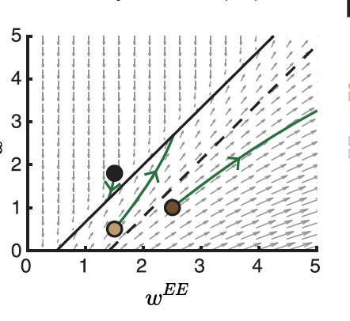

Inhibition to counter runaway dynamics \(Non\-Linear\)

As an attempt to make the inhibitory mechanism more robust, the authors introduce a new nonlinear model.
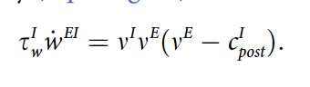

where the inhibitory synaptic weights have a nonlinear dependence on the postsynaptic firing rate. Under this new rule, the authors calculate the condition for obtaining stable synaptic weights as the following:
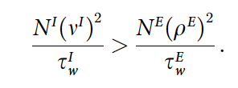

In addition, this condition corresponds a wide region of synaptic stability when visualised under the phase plane:
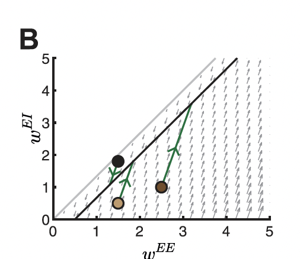

Where gray line indicates the seperation between the regions where postsynaptic rate is 0 \(no dynamics\) and not.

## Dynamic matching of excitatory and inhibitory postsynaptic thresholds

In the section above, it was considered that the excitatory and inhibitory postsynaptic thresholds \(c\_E and c\_I\)are equal.  If the excitatory threshold is lower than the inhibitory threshold, then both the excitatory and inhibitory synapses grow unboundedly. If, on the other hand, the inhibitory threshold is lower than the excitatory threshold, then both the excitatory and inhibitory synapses steadily decrease. 

In biological circuits, one would expect that these thresholds are not equal. Hence, the authors propose a dynamic regulation of both these thresholds such that they are shifting in opposite directions. When they in the end dynamically equate, we can once more observe the stable properties we observe in the previous section.  Sliding Rules:

|Threshold Type      |Postsynaptic rate is HIGHER than thresolds|Postsynaptic rate is LOWER than threshold|
|--------------------|------------------------------------------|-----------------------------------------|
|Excitatory Threshold|Increase                                  |Decrease                                 |
|Inhibitory Threshold|Decrease                                  |Increase                                 |

Implementing this dynamic matching process leads to different threshold configurations. Hence, a wide variety of different postsynaptic rates is possible depending on the different initialisation of the thresholds.

Under most conditions these can be matched and hence the majority of the paper considers them static and equal.

## Regulation of Network Response to Perturbations

The excitatory presynaptic input is perturbed.

- Independent of the direction of perturbation, the inhibitory plasticity rule brings the excitatory rate back to the target rate \(not the inhibitory rate\)
- 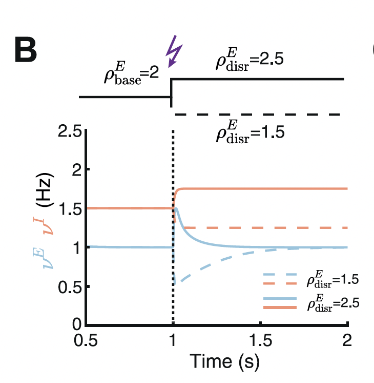
- Weights Dynamics due to perturbation:
- 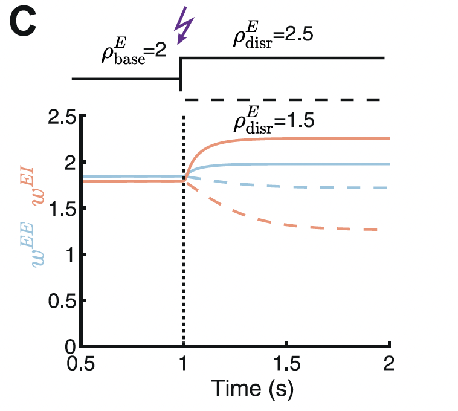

## Gating of receptive field formation via a disinhibitory signal

So far, the analysis focused on stability. In this part, the authors investigate learning. In order for a network to be flexible enough to learn, there must be sufficient flexibility in the network configuration.

Disinhibition

In the first set of experiments, the author apply disinhibition by changing the external input to the inhibitory population. Reducing the external input to the inhibitory neurons,  decreases the inhibitory input on the postsynaptic neuron and we observe potentiation of the E\-E synapses. \(Vice Versa\)

Competition/Independent inputs

In order to investigate learning, the authors adopt a widely used mechanism to induce learning, inhibition of the inhibitory population. For this analysis, the model is extended to look as follows:
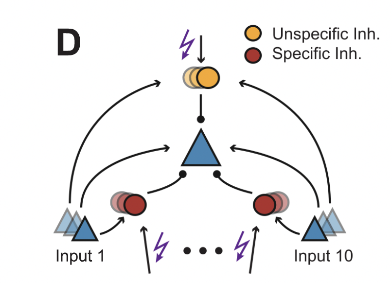

The postsynaptic neuron receives inputs from 10 independent  sets of excitatory and \(specific\-\)inhibitory populations. It receives further **unspecific** inhibition from a separate population that is randomly fed inputs from each of the 10 inhibitory populations. Results:

- Inhibition through the non\-specific population does not induce competition \(does not selectively potentiate E\-E\). In this case, the selective potentiation of the E\-E wights corresponding to the inputs stimulated at a given time is counteracted by the potentiation of the I\-E weights specific to those inputs
- Inhibition through equally inhibiting all specific inhibitory populations, leads to strong potentiation of E\-E weights corresponding to only a subset of inputs. In this case, the selective potentiation of the E\-E weights corresponding to the inputs simulated at a given time is countered by the potentiation of all unspecific I\-E inputs \(the specific ones have been kind of quietened out\). 

## Correlation to Heterosynaptic Plasticity Work at MPI

- A framework on how such an inhibition could have been used in conjunction with the heterosynaptic effects observed in the thesis in order to prevent runaway dynamics. Potentially, the inhibitory rules we used were in a very narrow range that allowed very difficult simulatibility
